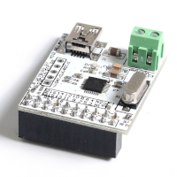
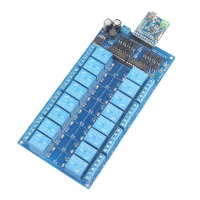
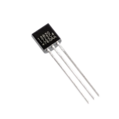
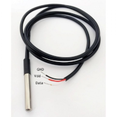

# Supported devices

## HID/UDB interface

| **Nuvoton relay controller** | USB HID relay controller board, from Nuvoton - Winbond Electronics Corp. |

This relay USB controller is almost identical to the Sainsmart 16-channel controller, except that the state of the relays are in bit-order from 0 to 16, LSB first.
  

It's a Chinese product with precious little and useless [documentation](https://www.cafago.com/en/p-e1812-1.html) and support.

Identifying devices:
The Nuvoton device has no serial number. The only way to uniquely identify multiple devices connected, is to use the physical port paths.
The HIDAPI enumeration returns a device node path. As the device node changes, when reconnected, Its unreliable as identification.

The Nuvoton HID relay controller can only be distinguished from the Saintsmart relay controller, by the manufacturer_string.

The device identification looks like this: **hidusb#0416:5020::Nuvoton#** 

Example get relay state:

\> devia hidudb#0416:5020 1 
hidusb#0416:5020::Nuvoton#0002:0005:00 1 on

Example set all relays off

\> devia hidudb#0416:5020 all off  
hidusb#0416:5020::Nuvoton#0002:0005:00 all 0000000000000000

action can be both 0/1 and off/on
Attribute can be 1-16, all or 0

## One-wire interface

**DS18B20 Temperature sensor**   

The DS18B20 Temperature Sensor, is a widely used chip. Its easy to use, and has a unique 64-bit ID, that makes it possible to have more than 200 devices mounted on the same two or tree wire bus ( signal, gnd and optional vcc) 
Temperature range: -55°C to +125°C ±0.5 with a programmable Resolution from 9 Bits to 12 Bits

The device identification looks like this: **w1#28-011581cb99ff** 

Example get temperature:

\> devia w1#28-011581cb99ff temperature
w1#28-011581cb99ff temperature 24725

Example set resolution to 9 bits:

\> devia w1#28-011581cb99ff resolution 9
w1#28-011581cb99ff resolution 9

